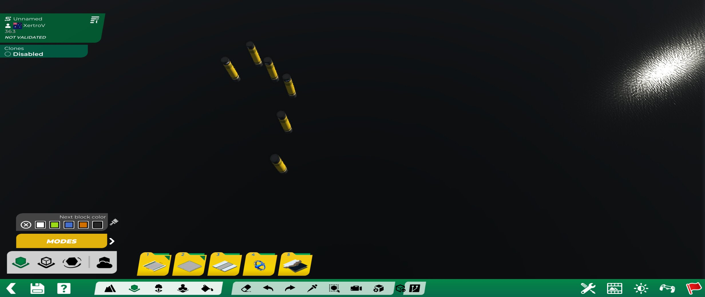

# TM Control MCP

**Local Openplanet bridge for controlling Trackmania from external tools and AI agents.**

`tm-control-mcp` is an Openplanet plugin that exposes Trackmania’s **map editor**,
**main menu**, and related game state over a **localhost JSON TCP socket**. Coding
agents, scripts, and MCP-style clients can create maps, place freeblocks and
items, drive menu flows, take screenshots, inject ManiaScript, and clean up after
themselves — without clicking the UI by hand.

| | |
|---|---|
| **Socket** | `127.0.0.1:30006` (configurable) |
| **Protocol** | One newline-terminated JSON request per TCP connection; newline JSON response; socket closes |
| **Platform** | Trackmania (current) + [Openplanet](https://openplanet.dev/) |
| **Hard deps** | [Editor++](https://openplanet.dev/plugin/editor) (`Editor`) · [MLHook](https://openplanet.dev/plugin/mlhook) |
| **License** | Dual **[Unlicense](./UNLICENSE)** **or** **[CC0 1.0](./CC0-1.0)** — public domain / no attribution required (GitHub may show “Other”) |
| **Status** | Active development (`info.toml` `0.2.0`) — first tagged public release |
| **Script timeout** | `15000` ms (`info.toml` `[script] timeout`) — long menu/place/wait tools need headroom |
| **Security** | Localhost JSON, **no auth** → [SECURITY.md](./SECURITY.md) |
| **Releasing** | Agent checklist → [RELEASE.md](./RELEASE.md) · history → [CHANGELOG.md](./CHANGELOG.md) |
| **Migration** | From tm-mcptm → [docs/migration-from-mcptm.md](./docs/migration-from-mcptm.md) |



> **Safety:** the control socket is **localhost-only by design** and has **no auth**.
> Do not bind it to a public interface. Details: [SECURITY.md](./SECURITY.md).

---

## What it provides

### For AI / agent workflows

- **Readiness & waiting** — `GetReadiness`, `WaitUntil`, and `tools/call.py`
  `--until-ready` / `--wait-mode` so agents stop guessing “is the editor ready?”
- **Provenance tags** — `SetAgentTag` → place → `RemoveByTag` cleans agent debris
  without nuking the whole map (`ClearMapContent` remains available when you mean it)
- **Placement verification** — `AssertPlacement` (deltas, near-point, tags)
- **Structured errors** — failed tools can include `code`, `retryable`,
  `requiredMode`, `hint` (plus the classic `error` string)
- **In-plugin guides** — `ListGuides` / `GetGuide` (menu nav, vistas, skins,
  cleanup, manialink runner, …)
- **Screenshots** — `TakeScreenshot` with optional Linux-side path detection via `call.py`

### Editor control

- Mode / map / dialogs: `GetMode`, `OpenMapInEditor`, `GetMapInfo`,
  `GetMapEnvironment`, `SaveMapAs`, `GetDialog` / `RespondDialog`
- Cursor, selection, validation, camera (`ControlCursor`, `ControlSelection`,
  `ControlValidation`, `ControlCamera`, `FocusCamera`, …)
- **Freeblock / flying item placement** via Editor++ (`PlaceBlockViaEditorPlusPlus`,
  `PlaceItemViaEditorPlusPlus`) — preferred over raw grid `PlaceBlock` for free work
- **Named macroblocks** — compose in memory, batch-add blocks/items (with skins),
  preflight, place with offset/pivot rotation; **durable JSON save/load** under the
  Openplanet data folder
- Inventory browse + picker control (`BrowseInventoryTree`, `ControlInventory`,
  `SelectBlockModel` / `SelectItemModel` / `SelectMacroblockModel`, `ControlEditMode`)
- Deletion: recent/by-index via E++ `DeleteItems` / block delete; clear-all helpers

### Menu automation

- Full main-menu stack: route push (`SetMenuPage`), UI layer introspection,
  **OnAction clicks** (`ClickMenuButton` / `TriggerControlOnAction`)
- **Never use `TriggerPageAction`** — that path crashes; this plugin uses the same
  `CControlBase::OnAction` dispatch as a real click
- One-shot map create: `CreateMapViaMenu` (QuickStart off) or faster `EditNewMap`
- Leave editor/race: `BackToMainMenu`

### ManiaScript injection

- `RunManialinkScript` injects ad-hoc ManiaScript through MLHook into
  **menu / playground / editor** (same contexts as MLHook’s UILayers browser)
- Optional **result channel**: `collectMs` + `SendCustomEvent("MLHook_Event_McpAdHoc_Result", …)`

### Dev / RE diagnostics

Pointer peeks, safe memory reads, gizmo/fuzz helpers, macroblock header dumps —
**only in DEV builds** (`./build.sh dev` injects `defines = ["DEV"]`). Release
`.op` packages omit these tools from the registry.

**Ground truth tool list:** `{"route":"tools"}` at runtime, or every
`MakeTool("…")` in `src/McpTools.as` (**100 tools** (release; +7 DEV-only) at last count).

---

## Requirements

1. **Trackmania** (Nadeo) running under your normal install (native Windows or Proton/Wine).
2. **[Openplanet](https://openplanet.dev/)** for Trackmania.
3. Plugins (install from Openplanet site or your usual channel):
   - **[Editor++](https://openplanet.dev/plugin/editor)** — dependency id `Editor`  
     Tested with **0.8.x** (including letter/dev builds that export free placement + map objectives).  
     Needs a build that exports `PlaceBlocks` / `DeleteItems` / `GetMapNbClones` (etc.).
   - **[MLHook](https://openplanet.dev/plugin/mlhook)** — dependency id `MLHook`  
     Tested with **≥ 0.5.4** (site id 252). Required for menu `Router_Push` and Manialink inject.
   - **[MLFeedRaceData](https://openplanet.dev/)** — dependency id `MLFeedRaceData`  
     Required for `GetRaceData` / `GetPlayers` race-mode tools.
4. This plugin loaded as a **folder plugin** (dev) or `.op` package (release build).

Optional host tooling:

- `python3` for `tools/call.py` and tests
- `openplanet-lsp` / `tm-remote-build` if you use `./build.sh dev` reload (optional; can skip)

---

## Install (dev folder plugin)

```bash
git clone https://github.com/clankercode/tm-control-mcp.git
cd tm-control-mcp

# Stage into Openplanet Plugins and reload (if RemoteBuild is available)
./build.sh dev

# If openplanet-lsp false-positives are noisy but in-game compile is green:
TM_PLUGIN_SKIP_LSP=1 ./build.sh dev
```

Default stage path: `~/OpenplanetNext/Plugins/tm-control-mcp`  
Override with `OPENPLANET_DIR` / `PLUGINS_DIR`.

**Release `.op` package:**

```bash
./build.sh release   # → tm-control-mcp-<version>.op
```

Enable the plugin in Openplanet’s UI. Confirm the socket:

```bash
python3 tools/call.py status
python3 tools/call.py GetMode
```

### Openplanet settings (host / port / timeout)

This plugin exposes **Server** settings (and any future categories) through Openplanet’s
normal settings UI **and** via MCP tools (`ListPluginSettings` / `SetPluginSetting`).

**UI path**

1. Open the Openplanet overlay in-game.
2. Open **Settings** (or Scripts → plugin settings).
3. Select **TM Control MCP** (dev builds may show **TM Control MCP (Dev)**).
4. Category **Server**:
   - **Socket Host** — default `127.0.0.1` (keep localhost-only)
   - **Socket Port** — default `30006`
   - **Startup Delay (ms)** — delay before the listener binds
   - **Trace Requests** — log request/response payloads to `Openplanet.log`

**Host/port changes require a plugin reload** (disable/enable the plugin, or
`ControlPlugin action=reload` on this plugin — the socket drops until reload finishes).

**Script execution timeout** is **not** a runtime setting: it is
`timeout = 15000` in `info.toml` (15s). Raise it there and rebuild/reload if a
tool legitimately needs longer than 15s of continuous script time. Openplanet
kills the script if a single invocation exceeds this budget.

**Via MCP** (after the plugin is loaded):

```bash
python3 tools/call.py ListPluginSettings '{"category":"Server"}'
python3 tools/call.py GetPluginSetting '{"varName":"S_TmMcpPort"}'
# Example: change port (then reload plugin + point call.py --port)
python3 tools/call.py SetPluginSetting '{"varName":"S_TmMcpPort","value":30007}'
python3 tools/call.py ControlPlugin '{"action":"reload","id":"tm-control-mcp"}'
```

### Plugin manager tools

| Tool | Role |
|------|------|
| `ListPlugins` | `Meta::AllPlugins` (+ optional unloaded) |
| `GetPlugin` | One plugin by id/name; optional embedded settings |
| `ControlPlugin` | `enable` / `disable` / `setEnabled` / `reload` / `unload` / `load` / `openSettings` |
| `ListPluginSettings` | List typed settings for a plugin (default: self) |
| `GetPluginSetting` / `SetPluginSetting` / `ResetPluginSetting` | Read / write / reset |
| `SavePluginSettings` | `Meta::SaveSettings()` |

`ControlPlugin` refuses **disable/unload of itself** so agents cannot brick the
control channel by accident. `reload` of self is allowed but drops the socket.
---

## Protocol

One JSON object per connection, newline-terminated. Response is one JSON object + newline.

**Status**

```json
{"route":"status"}
```

**List tools**

```json
{"route":"tools"}
```

**Call a tool**

```json
{"route":"call","tool":"GetMode","input":{}}
```

Tool names also work as routes:

```json
{"route":"GetMapInfo","input":{}}
```

Typical success shape:

```json
{"ok":true,"route":"call","data":{"tool":"GetMode","result":{"success":true,"output":{"mode":"Editor"}}}}
```

Errors may include structured fields:

```json
{"success":false,"error":"…","code":"wrong_mode","retryable":true,"requiredMode":"Editor","hint":"…"}
```

### Client: `tools/call.py`

```bash
python3 tools/call.py status
python3 tools/call.py --pretty GetMode
python3 tools/call.py GetReadiness '{"want":"editor"}'
python3 tools/call.py --until-ready editor GetMapInfo
python3 tools/call.py --wait-mode Editor --wait-timeout 30 GetMode
python3 tools/call.py PlaceItemViaEditorPlusPlus \
  '{"itemPath":"LightCube2m","x":128,"y":64,"z":128,"yaw":15}'
```

Behavior:

- Compact JSON by default (`--pretty` for humans)
- Checks for a real `Trackmania.exe` process before connecting (`--skip-process-check` for raw socket debug only)
- `--strict` validates tool input against the live schema when available
- Screenshot path detection under common Proton prefixes (`TM_USER_GAME_FOLDER` override)

---

## Agent-oriented quick start

```bash
# 1. Preflight
python3 tools/call.py --until-ready editor GetReadiness '{"want":"editor"}'

# 2. Tag agent work, place, verify, clean
python3 tools/call.py SetAgentTag '{"tag":"agent:demo"}'
python3 tools/call.py PlaceItemViaEditorPlusPlus \
  '{"itemPath":"LightCube2m","x":200,"y":80,"z":200}'
python3 tools/call.py AssertPlacement \
  '{"expectItemsDelta":1,"near":{"x":200,"y":80,"z":200,"radius":5},"tag":"agent:demo","tagMinCount":1}'
python3 tools/call.py RemoveByTag '{"tag":"agent:demo"}'

# 3. Named macroblock batch place
python3 tools/call.py CreateNamedMacroblock '{"name":"part-a","replace":true}'
python3 tools/call.py AddBlocksToNamedMacroblock '{"name":"part-a","blocks":[
  {"blockName":"RoadTechStraight","x":0,"y":0,"z":0,"yaw":0},
  {"blockName":"RoadTechStraight","x":32,"y":0,"z":0,"yaw":0}
]}'
python3 tools/call.py PreflightNamedMacroblockPlacement '{"name":"part-a","offsetX":128,"offsetY":64,"offsetZ":128}'
python3 tools/call.py PlaceNamedMacroblock '{"name":"part-a","offsetX":128,"offsetY":64,"offsetZ":128}'
python3 tools/call.py SaveNamedMacroblock '{"name":"part-a"}'   # durable JSON

# 4. Menu → new map (QuickStart must be off for CreateMapViaMenu)
python3 tools/call.py CreateMapViaMenu \
  '{"mapType":"race","environment":"Stadium","mood":"Day","inputDevice":"mouse","difficulty":"simple","timeoutMs":15000}'
# or faster title path (Stadium: omit deco or use 48x48Day; other envs need real deco):
python3 tools/call.py EditNewMap '{"environment":"Stadium","decoration":"48x48Day"}'
```

**Habits that keep agents reliable**

1. Prefer `GetReadiness` / `WaitUntil` / `--until-ready` before mutate.
2. Tag placements; clean with `RemoveByTag` instead of blind clear.
3. Prefer E++ free placement and named macroblocks over one-by-one grid place.
4. After menu nav: wait for `pageVisible` / mode change.
5. Stadium maps: empty `decoration=""` can trap the vista prompt — use a real deco or omit.
6. Do not depend on old disabled library plugins (`mcp-tm` / `tm-mcptm`).

---

## Current tools (100 release / 107 DEV)

Ground truth: every `MakeTool("…")` registration in `src/McpTools.as`.
Prefer `{"route":"tools"}` at runtime if this list drifts.

### Mode / map / dialogs

| Tool | Summary |
|------|---------|
| `GetMode` | Current game mode (Menu / Editor / Race / …). |
| `OpenMapInEditor` | Open a local map file in the editor (`path`). |
| `GetMapInfo` | Current editor map name and counts (+ bounds). |
| `GetMapEnvironment` | Collection, decoration, map type/style, mood, collection-unit metadata. |
| `ControlMapObjectives` | Get/set race objectives: `nbClones`, `nbLaps`, `isLapRace` (E++). |
| `SaveMapAs` | Save under user Maps (`name`+`folder` or `fileName`; `overwrite`). |
| `GetDialog` | Inspect `BasicDialogs` state / active frame. |
| `RespondDialog` | Respond: `yes`, `no`, `cancel`, `ok`, `validate`, `hide`, … |

### Readiness / agent provenance / assert

| Tool | Summary |
|------|---------|
| `GetReadiness` | Composite preflight (`want=editor\|menu\|any\|race`). |
| `WaitUntil` | Poll mode/dialog/editorReady/pageVisible/map counts/readiness (`timedOut` on budget). |
| `SetAgentTag` | Default provenance tag for subsequent `Place*` calls (empty clears). |
| `ListTagged` | List tracked tagged placements (`prefix` / `tag:` prefix). |
| `RemoveByTag` | Delete live objects matching tag (re-resolve by pos+idName); optional `dryRun`. |
| `ClearTagIndex` | Drop sidecar index only (no map mutation). |
| `AssertPlacement` | Verify deltas / near / tags after place. |

### Editor selection / cursor / camera / edit mode

| Tool | Summary |
|------|---------|
| `ControlValidation` | Validation / test / playground. |
| `ControlSelection` | Copy-paste / custom selection. |
| `GetCursor` | Editor cursor **coord** + selected block name/id. |
| `GetEditorSelectionState` | Placement modes, picked block, selected models, cursor, variant. |
| `ControlCursor` | raise/lower/rotate/move (relative/cardinal), followCamera, RGB, … |
| `ControlEditMode` | Inspect/set `EditMode` / `PlaceMode`; optional model select. |
| `GetEditorCamera` / `SetEditorCamera` | Numeric camera target/angles/distance. |
| `ControlCamera` | centerOnCursor, watchWholeMap/start/CP/finish, zoom, look, … |
| `FocusCamera` | Focus on world `(x,y,z)` via E++ animation. |
| `TakeScreenshot` | Built-in viewport screenshot. |

### Blocks / items (read)

| Tool | Summary |
|------|---------|
| `GetBlocks` | By grid/world radius, model query, freeblock filter. |
| `GetRecentBlocks` | Last N blocks (freeblock pos/rot readback). |
| `GetBlockAt` | Exact grid `(x,y,z)`. |
| `GetItems` | Near world pos, or all up to `limit`. |
| `GetRecentItems` | Last N anchored items. |

### Inventory / models

| Tool | Summary |
|------|---------|
| `GetInventorySummary` | Cache counts + scan status. |
| `FindInventory` | Search blocks/items/macroblocks. |
| `RefreshInventory` | Rescan after mid-session content adds. |
| `BrowseInventoryTree` | Read-only tree (`root`, `path`, `depth`, `query`, …). |
| `ControlInventory` | `status` / `select` / `openFolder` via inventory SelectArticle/SelectNode. |
| `InspectMacroblockModel` | Loaded MB by name/path/index. |
| `ListMacroblockInstances` | Placed native MB instances. |
| `FindBlockModels` | Search loaded block models. |
| `SelectBlockModel` / `SetCursorBlock` | Set selected block model. |
| `SelectItemModel` / `SelectMacroblockModel` | Picker helpers for item/MB. |

### Named macroblocks

| Tool | Summary |
|------|---------|
| `CreateNamedMacroblock` | Create/replace in-memory handle. |
| `GetNamedMacroblock` / `ListNamedMacroblocks` / `ClearNamedMacroblock` | Inspect / list / clear. |
| `AddBlock(s)ToNamedMacroblock` | Free block specs (variant, bg/fg skins). |
| `AddItem(s)ToNamedMacroblock` | Flying item specs by inventory path (+ skins). |
| `PlaceNamedMacroblock` | Place via E++ with offset/pivot rotation + mapPre/mapPost. |
| `PreflightNamedMacroblockPlacement` | Non-mutating extents/bounds/model checks. |
| `SaveNamedMacroblock` | Persist JSON under Openplanet data `tm-control-mcp/named-mb/`. |
| `LoadNamedMacroblock` | Load durable JSON into memory (resolves models). |
| `ListSavedNamedMacroblocks` | List durable JSON files. |

### Placement / deletion / undo

| Tool | Summary |
|------|---------|
| `CanPlaceBlock` | Grid/terrain place check without mutating. |
| `PlaceBlock` | Grid block place. |
| `PlaceBlockViaEditorPlusPlus` | Free blocks via E++ (preferred for free work). |
| `PlaceItemViaEditorPlusPlus` | Flying items via E++. |
| `RemoveBlock` | Remove at grid coords. |
| `ClearBlocks` / `ClearItems` / `ClearMapContent` | PluginMapType remove-all helpers. |
| `RemoveRecentBlocks` / `RemoveBlocksByIndex` | E++ block deletion. |
| `RemoveRecentItems` / `RemoveItemsByIndex` | E++ `DeleteItems` (buffer fallback opt-in). |
| `Undo` / `Redo` | Editor undo/redo. |

### Menu automation

Menu stack is **landed**. Clicks use `CControlBase::OnAction` — **not**
`TriggerPageAction`. Poll `GetActiveMenuPages` / `GetMode` / `GetDialog` after nav.

| Tool | Summary |
|------|---------|
| `SetMenuPage` | MLHook `Router_Push` hierarchical `route`. |
| `GetMenuPage` / `ListKnownMenuRoutes` | Mode + menu module; route catalogue. |
| `EditNewMap` | Title-control new map (env + decoration + mapType). |
| `BackToMainMenu` | Unwind Editor/Race → menu. |
| `GetUILayers` / `GetActiveMenuPages` / `GetLayerTree` / `GetLayerXml` | Layer introspection. |
| `ListMenuManialinkControls` / `FindMenuButtons` / `FindControlsByClass` / `FindControlsByLabel` | Discovery. |
| `InspectMenuControl` / `FocusMenuControl` / `SetMenuControlVisible` | Probe / focus / show-hide. |
| `ClickMenuButton` / `TriggerControlOnAction` | Real click dispatch. |
| `CreateMapViaMenu` | Full `Page_MapEditorSettings` click-chain → Editor (QuickStart off). |

### ManiaScript + guides

| Tool | Summary |
|------|---------|
| `RunManialinkScript` | MLHook inject (`menu`/`in-map`/`in-editor`/`current`); optional `collectMs`/`resultEvent`. |
| `ListGuides` / `GetGuide` | In-plugin documentation topics. |

### DEV / RE diagnostics

Only registered when the plugin is built with `defines = ["DEV"]`
(`./build.sh dev`). Release `.op` / `release-check` builds **omit** these tools.

| Tool | Summary |
|------|---------|
| `RunGizmoApplyBlock` | Free block through E++ gizmo apply path. |
| `RunRandomFuzz` | Random place N blocks/items in a world bbox. |
| `RunComputeItemsDiagnostic` / `DevComputeItemsPointers` | Macroblock compute-items probes. |
| `DevSafeRead` / `DevGetPointers` | Safe memory read / pointer dumps. |
| `DumpMacroblockHeader` | MB flags/buffers/raw header words. |

### Openplanet plugins & settings

| Tool | Summary |
|------|---------|
| `ListPlugins` | Loaded plugins (`query`, `includeDisabled`, `includeUnloaded`). |
| `GetPlugin` | One plugin by id/name; `includeSettings` optional. |
| `ControlPlugin` | enable/disable/reload/unload/load/openSettings (no self-disable/unload). |
| `ListPluginSettings` | Settings for a plugin (default: this MCP plugin). |
| `GetPluginSetting` / `SetPluginSetting` / `ResetPluginSetting` | Typed get/set/reset. |
| `SavePluginSettings` | Persist settings to disk. |

---

## Behavioral notes

### Placement and map metadata

Mutating placement tools include `mapPre` / `mapPost` (name, size, block/item/vertex counts, bounds). Prefer verifying with `GetBlockAt` / `GetRecent*` / `AssertPlacement`.

`SaveMapAs` writes under the user `Maps` folder; responses may include a Wine/Trackmania `gamePathHint` — map through your Proton prefix on Linux.

### Free placement and inventory

Prefer **E++ free placement** and **named macroblocks** for generated builds. Rotation defaults to **degrees** (`pitch`/`yaw`/`roll`); use `*Rad` for radians. Autofocus is on by default for free place tools.

Path-based place remains the reliable headless path; `ControlInventory` is for picker parity / UI-native flows.

### Item delete via `Editor::DeleteItems`

`RemoveRecentItems` / `RemoveItemsByIndex` call E++ **`DeleteItems`** (works when `PluginMapType.Items` is empty). Direct `AnchoredObjects` buffer removal is **opt-in** (`forceBufferFallback=true`) and reports `undoSupported=false`.

### Named macroblocks + skins

Block/item specs support `variant`, `bgSkin`, `fgSkin`. Skins apply after successful `PlaceNamedMacroblock` and are verified when possible. Durable JSON is v2-capable (item skins) with v1 load compatibility. In-memory handles alone do not survive reload — use `SaveNamedMacroblock`.

### Screenshots

`TakeScreenshot` triggers the game’s viewport capture. `call.py` can detect the new file under the Proton user folder (`TM_USER_GAME_FOLDER` override).

### Menu automation details

- Routes are **hierarchical** (`/create/mapeditorsettings`, not bare `/mapeditorsettings`).
- `SetMenuPage` only while main-menu module is active.
- Side-effect / playground-launch routes blocked unless `allowPlaygroundLaunch:true`.
- Enter editor: `EditNewMap` (fast) or `CreateMapViaMenu` (full UI; QuickStart off).
- Leave: `BackToMainMenu`, poll until `mode=="Menu"`.

### RunManialinkScript

| Arg | Default | Notes |
|-----|---------|--------|
| `script` | *(required)* | No outer `<manialink>` — MLHook wraps as `MLHook_<pageUid>`. |
| `context` | `current` | `menu` / `in-map` / `in-editor` / `current`. |
| `pageUid` | `McpAdHoc` | Attach id stem. |
| `replace` | `true` | Replace same uid. |
| `persist` | `true` | If false, remove after `waitMs`. |
| `waitMs` | `150` | Yield for inject queue (capped). |
| `collectMs` | `0` | If &gt;0, register result hook and collect events. |
| `resultEvent` | `McpAdHoc_Result` | Script: `SendCustomEvent("MLHook_Event_"+resultEvent, [...])`. |

Bad ManiaScript can force a game recovery restart — keep scripts small.

### Stadium / decoration pitfall

For `EditNewMap`: **Stadium** — omit decoration or use `48x48Day`. Non-Stadium needs a real decoration string (or use `OpenMapInEditor` / `CreateMapViaMenu`). Empty `decoration=""` can leave the vista prompt up.

---

## Project layout

```
src/                 Openplanet Angelscript plugin (module TmMcp)
tools/call.py        CLI client + wait helpers + screenshot detection
tests/               pytest (call.py waits, camera math, …)
docs/ research/      Design notes and RE notes
AGENTS.md            Short agent-oriented project notes
info.toml            Openplanet manifest (deps: Editor, MLHook)
build.sh             dev stage+reload · release .op pack
```

---

## Development

```bash
# Stage + reload into game
TM_PLUGIN_SKIP_LSP=1 ./build.sh dev

# Unit tests that do not need the game
python3 -m pytest tests/test_call_wait.py -q

# Live smoke (game + plugin running)
python3 tools/call.py status
python3 tools/call.py GetReadiness '{"want":"editor"}'
```

In-game Openplanet compile is the ground truth if LSP reports nested-enum / dependency noise.

---

## Security

**Localhost-only control socket with no authentication.** Anyone on the machine
can mutate maps, drive menus, and call DEV tools while the plugin is loaded.
Keep **Socket Host = `127.0.0.1`**. Full threat model and hardening:
**[SECURITY.md](./SECURITY.md)**.

---

## Related

- **Editor++** — free placement, inventory cache, deletion, camera helpers this plugin calls into
- **MLHook** — menu router push, Manialink inject, custom events
- Sibling tooling in the Openplanet ecosystem (RemoteBuild, openplanet-lsp) optional for the reload loop

---

## License

Dual-licensed under the **[Unlicense](./UNLICENSE)** **or** **[CC0 1.0 Universal](./CC0-1.0)**, at your option. See [`LICENSE`](./LICENSE).

No warranty. Trackmania and Nadeo assets remain subject to their own terms; this repo is the control bridge only.

---

## Credits

Author: **XertroV** (`info.toml`). Maintained under **[clankercode](https://github.com/clankercode)**.
